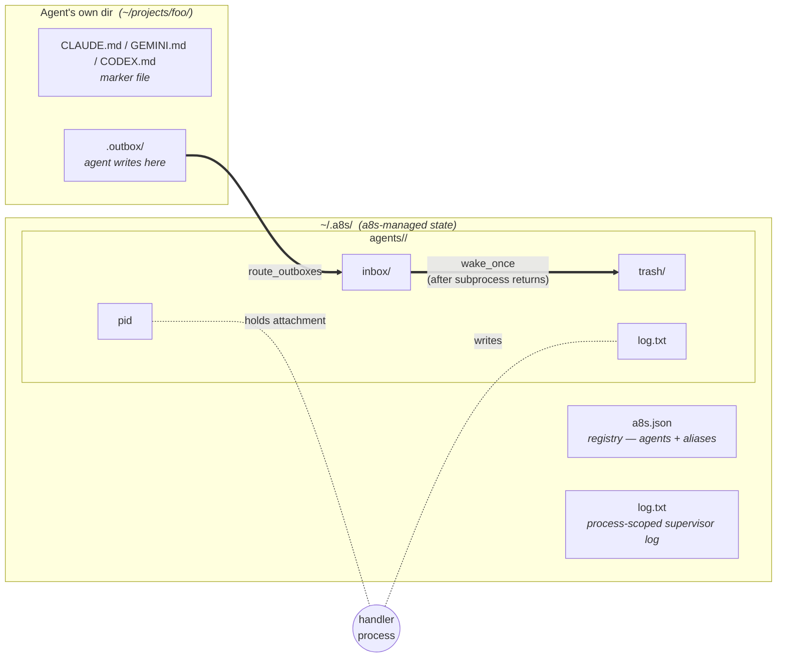

# a8s — Agent Infinity System

A lightweight way to wire multiple agents — Claude Code sessions, Gemini CLI projects, codex sessions, plain scripts, eventually humans — into a team that can talk to each other.

> **Status: pre-v1.** Surface and storage layout will keep changing without migration paths until the design settles.

## Why

Modern agent tooling like Claude Code's subagents is great inside one process and one tool's permission model. But:

- **Process and machine boundaries matter.** One agent might need codex's workspace-write sandbox; another might need Claude with a narrow allowlist; another might need to run on a different machine entirely. Cramming them into a single host process is the wrong abstraction.
- **Members shouldn't have to know about a8s.** Drop in any existing project unchanged. The agent just sees a `tell` command and wakes to messages — same shape whether it's a Claude session, a Python program, or (someday) an SMS gateway routing to a human.
- **Recipient opacity is the load-bearing invariant.** The sender doesn't know whether the recipient is a Claude session, a script, or a person on the other end of an email-to-message bridge. That's how this scales — anywhere the abstraction fits, you plug in.
- **Eventually, one fabric across machines.** Tracked in #63: two a8s clusters on the same network see each other and route messages as peers. The local design today is shaped to accommodate that without breaking.

The win at scale: a team of agents that share knowledge through ordinary conversation grows faster than a collection of silos, and you interact with all of them through one verb (`tell`).

## Mental model




Three concepts:

- **Registry** (`~/.a8s/a8s.json`) — the list of agents and aliases. Agents have a name, a directory, and a *definition* (a JSON file describing how to wake them). Optional `safe_dirs` remains in the schema but is unused for attachment routing: tell stages files into `<root>/.files/` and envelopes reference filename only.
- **Handlers** — a process that holds the attachment for one or more agents. Pid file at `~/.a8s/agents/<NAME>/pid`. One agent is handled by exactly one process at a time, but one process can handle many agents (typically by attaching to an alias).
- **Mailboxes** — agents write to `<agent-root>/.outbox/`; routing copies into `~/.a8s/agents/<RECIPIENT>/inbox/`; the handler drains the inbox by waking the agent's CLI. Routing is process-agnostic — only waking requires the handler attachment.

The router doesn't trust the sender. The `from` field is force-overwritten to the actual enclosing agent at routing time. An agent can't impersonate another by hand-writing JSON.

## Quickstart

```bash
# Find candidate agents.
a8s discover ~/projects

# Register them. Auto-detects the right definition from the marker file
# (CLAUDE.md / GEMINI.md / CODEX.md).
a8s add CLAUDE ~/projects/code-review
a8s add GEMINI ~/projects/research

# Optional: group them.
a8s alias devs CLAUDE
a8s alias devs GEMINI

# Background daemon handling both members of the alias in one process.
a8s start devs

# See what's running.
a8s ls
#   CLAUDE  PID 12345  /Users/me/projects/code-review
#   GEMINI  PID 12345  /Users/me/projects/research

# Send messages. Woken agents get `TELL_OUTBOX_DIR` from a8s; manual tell
# requires `export TELL_OUTBOX_DIR=…/.outbox` (see docs/tell.md).
cd ~/projects/code-review
tell GEMINI "look at lines 40-80 of foo.py"
tell devs   "stand-up at 3pm"

# Read what each agent is doing.
a8s logs CLAUDE GEMINI --tail 20

# Stop the daemon (graceful — finishes the current wake first).
a8s stop devs
```

That's the full loop. Members don't know they're "in a8s" — they just see a `tell` command available in their shell and wake to messages the same way they wake to any prompt.

## Commands

### Registration


|                                |                                                                                                                                                                |
| ------------------------------ | -------------------------------------------------------------------------------------------------------------------------------------------------------------- |
| `a8s add <name> <dir> [<def>]` | Register an agent. Auto-detects definition from `<dir>`'s marker file unless `<def>` is given.                                                                 |
| `a8s remove <name>`            | Unregister an agent. Wipes `~/.a8s/agents/<NAME>/` and prunes the agent from any alias's member list (deletes empty aliases). Refuses if a handler is running. |
| `a8s define <name> [<path>]`   | Show or set the agent's definition file.                                                                                                                       |
| `a8s discover <path>`          | Walk a path for marker files; print suggested `add`+`define` commands. Read-only.                                                                              |
| `a8s agents`                   | List every registered agent and its definition.                                                                                                                |


### Aliases


|                                  |                                                                                      |
| -------------------------------- | ------------------------------------------------------------------------------------ |
| `a8s alias <alias> <member>`     | Create or extend an alias. Members can be agents or other aliases (cycles rejected). |
| `a8s unalias <alias> [<member>]` | Remove a single member, or the whole alias.                                          |
| `a8s aliases`                    | List every alias and its resolved members.                                           |


### Handlers


|                    |                                                                                                                                                                                                                                                                                     |
| ------------------ | ----------------------------------------------------------------------------------------------------------------------------------------------------------------------------------------------------------------------------------------------------------------------------------- |
| `a8s start <name>` | Spawn a detached background process to handle the agent (or every member of an alias, in one process).                                                                                                                                                                              |
| `a8s run <name>`   | Foreground attached loop. Aliases produce one process with interleaved output. Ctrl+C: graceful detach. 2nd Ctrl+C: kill the wake subprocess group.                                                                                                                                 |
| `a8s step <name>`  | Attach, do one route+drain pass, release. Heavyweight: detaches the current handler if any.                                                                                                                                                                                         |
| `a8s stop <name>`  | SIGTERM the handler. Aliases dedupe by PID — one signal per multi-agent handler. Graceful detach.                                                                                                                                                                                   |
| `a8s kill <name>`  | Per-agent force-detach: writes a kill-request, SIGUSR1s the holder. Holder kills the in-flight wake subprocess iff it's for that agent and releases the attachment; siblings keep running. Falls back to whole-process SIGTERM only if the holder doesn't honor the request in 10s. |
| `a8s exit`         | SIGTERM every running handler.                                                                                                                                                                                                                                                      |
| `a8s ls`           | List only running agents and their handler PIDs.                                                                                                                                                                                                                                    |


### Messaging


|                                                                             |                                                                                                                                                                                                                                                                                                                           |
| --------------------------------------------------------------------------- | ------------------------------------------------------------------------------------------------------------------------------------------------------------------------------------------------------------------------------------------------------------------------------------------------------------------------- |
| `a8s tell <name> <msg>`                                                     | Routed message via `_write_outbox` into the sender's configured outbox. `<name>` may be an agent or alias (fans out at routing time). Sender = agent whose root encloses CWD; router force-stamps `from` from outbox ownership.                                                                                           |
| `tell <name> <msg>` (top-level shim, `[~/bin/tell](/Users/neilo/bin/tell)`) | Delegates to `a8s tell` (`apps/a8s/tell.py`). Requires `TELL_OUTBOX_DIR` (a8s injects it on wake). Drops a JSON envelope — no `~/.a8s` access required. When the registry is reachable, recipient validation and `from` stamping apply. Windows: `tell.cmd`. Operator internals: `[docs/tell.md](docs/tell.md)`.          |
| `a8s logs <name>... [--tail N] [-f]`                                        | Read per-agent log files; one agent in append order, multiple merge by ISO timestamp. `-f` follows.                                                                                                                                                                                                                       |
| `a8s convo <name> [--limit N]`                                              | Markdown conversation history for an agent (messages to or from). Default `--limit 10`. Outbound headings use `##`, inbound use `###`. Archive: `~/.a8s/conversations.jsonl` (machine-wide; rotates at `convo_max_limit`, default 1000 — `a8s config`). |
| `a8s drain <name>`                                                          | Move pending inbox JSON to trash without waking the agent.                                                                                                                                                                                                                                                                |


### Configuration


| | |
|---|---|
| `a8s config` | List settings with effective values and source (`settings.json`, `env`, or default). |
| `a8s config get <key>` | Print one setting. |
| `a8s config set <key> <value>` | Persist to `~/.a8s/settings.json`. |
| `a8s config unset <key>` | Remove key from settings.json; fall back to env then default. |

Env vars apply only when a key is absent from `settings.json` (e.g. `A8S_CONVO_MAX_LIMIT`, `A8S_LOOP_INTERVAL`). `a8s config` with no arguments lists every knob — machine-wide, per-agent definition, registry, network, env, and constants — even read-only ones.


### Skills


|                      |                                                                                                         |
| -------------------- | ------------------------------------------------------------------------------------------------------- |
| `a8s install`        | Install bundled skills into the current agent dir (or `--global` for user home).                        |
| `a8s install-client` | Copy `apps/a8s` to `/usr/local/lib/a8s/` and install `/usr/local/bin/tell` (`sudo`). Re-run to upgrade. |


### Remotes (issue #63)


|                                                                |                                                                                                                                                                                                                                                                                                                                                                                                                                        |
| -------------------------------------------------------------- | -------------------------------------------------------------------------------------------------------------------------------------------------------------------------------------------------------------------------------------------------------------------------------------------------------------------------------------------------------------------------------------------------------------------------------------- |
| `a8s remote`                                                   | List configured remotes (transport, broker, topic, opts; passwords masked).                                                                                                                                                                                                                                                                                                                                                            |
| `a8s remote <name>`                                            | Show one remote's spec.                                                                                                                                                                                                                                                                                                                                                                                                                |
| `a8s remote <name> <broker-url> <topic> [--<opt> <value> ...]` | Register or overwrite a remote. Broker URL is `mqtt://host[:1883]` or `mqtts://host[:8883]`. Persistent session + QoS 1 are wired automatically so an offline cluster catches up on reconnect. Any `--<opt> <value>` past the broker and topic is forwarded verbatim to the transport — common ones are `--user U --pass P`, `--client_id ID`, `--keepalive N`. The transport rejects unknown options at load time so typos fail loud. |
| `a8s unremote <name>`                                          | Forget a remote. Running daemons keep using the prior config until restart.                                                                                                                                                                                                                                                                                                                                                            |


Remotes are git-shaped: an explicit list of places to fan messages out to. a8s only crosses cluster boundaries on `tell` / `prompt` — everything else (`a8s logs`, `a8s ls`, `a8s agents`) is strictly local. If you want cross-cluster log access, register an a8s connector that turns inbound tells into local `a8s logs` calls; a8s itself just enables the message + invocation path.

Configure as many remotes as you want and a8s publishes to all of them in parallel; receivers dedupe by ULID, so adding redundant brokers improves delivery without producing duplicate inbox writes. A message to an unknown-locally recipient publishes to all configured remotes and is delivered by whichever cluster has the recipient registered locally. Per-message exponential backoff (30s → 1m → 2m → 5m → 15m → 30m → 1h → 6h → 24h) retries unreachable remotes; after the schedule is exhausted the message is moved to the sender's trash with a "discarded after backoff" log.

File payloads (`FILE:`) are local-only in v1 — the sender's path doesn't exist on the receiving cluster. Cross-cluster file transfer rides issue #62.

`a8s` with no command prints help. There is no auto-discovery of agents from CWD — registration is always explicit.

### Per-agent take-over

`start`/`run`/`step` against an agent that's already attached to another live process performs a **per-agent** hand-off. The new caller drops a `detach-request` file under `~/.a8s/agents/<NAME>/`; the existing handler reads it at the top of its next iteration and releases just that one agent — its other handled agents keep running. Then the new caller atomically claims the pid file. There is never an orphan: at every moment, an agent is either attached to exactly one live process or it isn't running at all.

Concretely: P1 is `a8s start devs` (handling `[CLAUDE, GEMINI, FOO]`). You run `a8s run CLAUDE` in another window. CLAUDE moves to your foreground process; P1 keeps handling `[GEMINI, FOO]`. If you then `a8s run GEMINI` in a third window, GEMINI moves there; P1 keeps `[FOO]`. If P1's last agent gets pulled out, P1 exits cleanly with nothing left to handle.

`a8s kill <name>` works the same way but force: it writes a `kill-request` file and SIGUSR1s the holder, which kills the in-flight wake subprocess (if any) for just that agent and releases the attachment. P1 keeps its other agents either way.

Take-over has a 60-second timeout (kill is 10s). If the holder is wedged on a long LLM wake and doesn't honor the request in time, the requester errors out (or, for `kill`, escalates to a whole-process SIGTERM as a last resort).

## Definitions

Each agent has a definition file: a JSON document describing how to invoke its CLI for each verb. Built-in defaults ship in `apps/a8s/definitions/`:


| File            | Purpose                                                                                                                                                                                                                                            |
| --------------- | -------------------------------------------------------------------------------------------------------------------------------------------------------------------------------------------------------------------------------------------------- |
| `claude.json`   | Claude Code with `--permission-mode dontAsk` allowlist + `--continue`                                                                                                                                                                              |
| `agy.json`      | Antigravity (agy) with `--sandbox` + `--dangerously-skip-permissions` + `--continue` for headless operation                                                                                                                                        |
| `codex.json`    | Codex CLI with `--full-auto` workspace-write sandbox + `resume --last`                                                                                                                                                                             |
| `copilot.json`  | GitHub Copilot CLI with `--allow-all-tools` (required for non-interactive `-p` mode) + `--continue`. Marker is `.github/copilot-instructions.md` (Copilot's native repo-instructions location).                                                    |
| `cursor.json`   | Cursor Agent CLI (`agent`) with `-p --trust --force --approve-mcps --continue` for headless tool use. Marker is `CURSOR.md`.                                                                                                                       |
| `opencode.json` | [OpenCode](https://opencode.ai/) — BYO model. `opencode run --continue --dangerously-skip-permissions`. Operator picks the provider/model in each agent's own `opencode.json` (e.g. `{"model": "ollama/gpt-oss:20b"}`), not in the a8s definition. |
| `default.json`  | Fallback — runs `dummy-cli` and prints "no real CLI configured"                                                                                                                                                                                    |


### Marker files & auto-discovery

`a8s discover <path>` and `a8s add <name> <dir>` (without an explicit definition) figure out which CLI an agent uses by scanning for one of these marker files at the agent's root, in order:


| Marker                            | Kind     | Where the CLI itself looks                                                                                                                                                                         |
| --------------------------------- | -------- | -------------------------------------------------------------------------------------------------------------------------------------------------------------------------------------------------- |
| `CLAUDE.md`                       | claude   | [Claude Code memory](https://docs.claude.com/en/docs/claude-code/memory)                                                                                                                           |
| `GEMINI.md`                       | agy      | [Antigravity (agy) context files](https://github.com/google-gemini/gemini-cli/blob/main/docs/cli/configuration.md)                                                                                 |
| `CODEX.md`                        | codex    | [Codex CLI configuration](https://github.com/openai/codex)                                                                                                                                         |
| `.github/copilot-instructions.md` | copilot  | [Copilot CLI repository custom instructions](https://docs.github.com/en/copilot/how-tos/configure-custom-instructions/add-repository-instructions) — the same file Copilot itself auto-loads       |
| `CURSOR.md`                       | cursor   | a8s marker for [Cursor Agent CLI](https://cursor.com/docs/cli/using) agents. Cursor also loads `AGENTS.md` and `.cursor/rules/`; use `CURSOR.md` when this directory is a Cursor CLI agent in a8s. |
| `AGENTS.md` (fallback)            | opencode | [The agents.md standard](https://agents.md/) — tool-agnostic instructions stewarded by the [Agentic AI Foundation](https://agentic.foundation/) under the Linux Foundation                         |


The first four are **kind-specific** locations — for the tools that have a distinct native instruction file, a8s uses that location directly. For Copilot we use its repo-instructions location (`.github/copilot-instructions.md`) rather than inventing a `COPILOT.md` — same file serves both a8s discovery and Copilot's own persona loading.

[AGENTS.md](https://agents.md/) is **tool-agnostic** and shared by 20+ tools (OpenAI Codex, Google Gemini CLI, GitHub Copilot, Cursor, Aider, Zed, Warp, JetBrains Junie, OpenCode, …). Because it can't disambiguate which CLI to invoke, a8s only resolves it as a marker when **no kind-specific marker is present** — and it falls through to **OpenCode**, which is BYO-model (the operator picks the provider in each agent's own `opencode.json`). A directory with `CLAUDE.md` + `AGENTS.md` resolves to `claude`; a directory with `CURSOR.md` + `AGENTS.md` resolves to `cursor`; a directory with only `AGENTS.md` resolves to `opencode`.

### The single verb

Every wake reads `definition["invoke"]` — one argv per definition. There is no verb dispatch and no special-case branches: `prompt` and `clear` are gone. Every message is a `tell` with a force-stamped agent `from`, so the same argv shape covers every wake.

Strict opacity (issues #69, #70) still holds: a routed message looks identical whether it arrived directly or via alias fan-out — `$RECIPIENT` resolves to whatever the sender wrote in `to` (the alias name for fanned messages, the agent name for direct ones). Mailing-list semantics.

### Schema

```json
{
  "description": "...",
  "invoke": ["claude", "...", "--continue", "-p", "$SENDER tells $RECIPIENT ($AGE): $MESSAGE"],
  "idle":   { "timeout": 1800, "invoke": ["claude", "-p", "summarize the day's tells"] }
}
```

Argv elements run through six substitutions:

- `$SENDER` → sender's canonical name (always non-empty — every message has a force-stamped agent `from`).
- `$RECIPIENT` → what the sender wrote in `to` (alias name for fanned messages, agent name for direct ones).
- `$MESSAGE` → the message body (`content`, with any `ATTACHED FILE: <path>` lines appended for inbound attachments).
- `$TIMESTAMP` → ISO 8601 UTC timestamp the message was queued (e.g. `2026-04-28T14:30:00.123456Z`). Useful when you want a stable machine-readable time.
- `$AGE` → human-readable age relative to now (e.g. `5 minutes ago`). Computed at wake time, so a long backlog gets accurate values per message. Pick this OR `$TIMESTAMP` per definition based on which the LLM will read more naturally.
- `$A8S_DIR` → `apps/a8s/` itself, so definitions can point at bundled scripts (`default.json` uses this for `dummy-cli`).

`$TIMESTAMP` and `$AGE` are empty for any message without a `date` field (defensive — every `_write_outbox` stamps one).

Override per-agent with `a8s define <name> <path>` — point at any JSON. The file isn't moved or copied; the registry stores the path.

### Idle invoke (optional)

A definition's `idle` block fires `idle.invoke` when the agent has gone `idle.timeout` seconds without any wake activity. Update mechanics:

- `~/.a8s/agents/<NAME>/last-active` (ISO timestamp) is touched at every wake start, every wake end, and at the end of every idle invoke.
- After draining the inbox each iteration, `attached_loop` checks each handled agent: if `now - last_active >= timeout`, run `idle.invoke` via the same `run_with_prefix` machinery that real wakes use.
- A wake in flight blocks idle naturally — the loop is single-threaded for its handled agents and the inbox drain happens before the idle check.
- `timeout: 0` (or negative / non-numeric) disables idle.
- Argv expansion: `$SENDER`/`$MESSAGE`/`$TIMESTAMP`/`$AGE` are empty (no incoming message); `$RECIPIENT` is the agent's own name; `$A8S_DIR` resolves as usual.

This subsumes the retired `clear` use-case: define an idle invoke that runs whatever your CLI needs to reset session state (e.g. `claude -p "/clear"`).

### Batch invoke (optional)

Agents that can process multiple tells in one subprocess can declare a `batch` block. When **two or more** inbox messages are waiting, a8s wakes once with `batch.invoke` plus the message JSON file paths as trailing argv elements (shell-style — no extra placeholder).

```json
{
  "pause": 3,
  "invoke": ["my-agent", "--single", "$SENDER", "$MESSAGE"],
  "batch": {
    "invoke": ["my-agent", "--batch"],
    "limit": 5
  }
}
```

- `pause` — seconds to wait after the first inbox message of a burst before waking. Closely-spaced tells accumulate across handler iterations so `batch` is more likely to fire. `0` or omitted = wake as soon as the loop drains (previous behavior).
- `batch.invoke` — argv template with the same substitutions as `invoke` / `idle.invoke`.
- `batch.limit` — max messages per batch wake; defaults to **5**.
- One waiting message still uses normal `invoke` (unchanged).
- Paths point at the trashed inbox JSON files (under `~/.a8s/agents/<NAME>/trash/`), appended after the expanded `batch.invoke` argv.
- Batch argv expansion matches idle: `$RECIPIENT` is the agent's own name; `$SENDER` / `$MESSAGE` / `$TIMESTAMP` / `$AGE` are empty.

Debounce mechanics: on the first inbox message, a8s stamps `~/.a8s/agents/<NAME>/inbox-waiting-since` and skips waking until `pause` seconds elapse. Each loop iteration re-routes outboxes, so messages that arrive during the wait window join the inbox before the wake decision. The stamp clears when the inbox drains or a wake fires.

### Recipient transparency

The default definitions follow the opacity rule — `$SENDER tells $RECIPIENT: $MESSAGE` works equally well whether `$RECIPIENT` is an LLM session, a Python script, or (someday) an SMS gateway. Customize at your own risk.

## State on disk

The state root is `$HOME/.a8s` by default; set `A8S_HOME` to relocate it. This is the only relocation knob — everything below is relative to whichever path `A8S_HOME` points at (or the default). Useful for sandboxed end-to-end tests that mustn't touch the operator's real configuration.

```
~/.a8s/                       (or wherever A8S_HOME points)
├── a8s.json                  registry: { agents: {...}, aliases: {...} }
├── settings.json             operator settings (`a8s config`; env fills gaps)
├── network.json              configured remotes (absent → local-only)
├── seen-ids                  cluster-wide ULID ring for receive-side dedup
├── conversations.jsonl       routed message archive for `a8s convo` (see convo_max_limit)
├── log.txt                   process-scoped supervisor log
└── agents/
    └── <NAME>/
        ├── inbox/            pending JSON messages (drained by wake_once)
        ├── inbox.tmp/        maildir-style atomic stage for fan-out
        ├── pending/          messages a8s has ingested from .outbox/
        │                     awaiting full delivery — `<ulid>.json` plus
        │                     optional `<ulid>.json.retry` sidecar tracking
        │                     attempts + per-remote success
        ├── trash/             processed messages
        ├── log.txt            per-agent log (wakes, routing, subprocess output)
        ├── last-active        ISO timestamp; touched at wake start/end and
        │                     after every idle invoke (gates `idle.invoke`)
        └── pid                handler attachment

<agent-root>/
└── .outbox/                  agent writes here; a8s renames out — never
                              read-modify-writes — to ~/.a8s/agents/<NAME>/pending/
```

The outbox lives in the agent's own dir because some sandboxes (codex `--full-auto`) only let the agent write inside its workspace. Inbox/trash/pending live under `~/.a8s/` where the agent can't see them — and per the agent-directory invariant, a8s never sidecars or rewrites in `.outbox/`. New outbox files are atomically renamed to `pending/` on every routing pass; everything from there (sidecars, retries, trash, remote publishes) happens in `~/.a8s/`.

`from` is force-overwritten at routing time. An agent that hand-writes a JSON with `from: "VICTIM"` doesn't get to spoof — the file's outbox location is the unforgeable identity.

## Connectors

A connector is just an a8s agent whose `definition.invoke` runs a script instead of an LLM CLI. The first reference connector is the Gmail connector at `apps/a8s/connectors/gmail/`, which lets a human read and respond to a8s messages over email.

Strict recipient opacity holds: other participants `tell <name> ...` with no awareness that the recipient is Gmail-backed, a script, a human, or another LLM agent. The connector is the only thing that knows about its bridge format. See `apps/a8s/connectors/gmail/README.md` for setup.

## File proxy

A file-proxy agent communicates through filesystem sync instead of a CLI invocation. Designed for agents whose root is on a remote mount (rclone, NFS, Google Drive FUSE, etc.) where the "other side" polls for files independently.

### Setup

```bash
# Create the definition
cat > file-proxy.json << 'EOF'
{"proxy": "file", "idle": {"timeout": 30}, "files_ttl_hours": 48}
EOF

# Optional: custom dirs (absolute paths OK)
# {"proxy": "file", "inbox_dir": "/mnt/sync/in", "outbox_dir": "mail/out", "files_dir": ".files", ...}

# Register with a mounted root directory
a8s add my-email /mnt/gdrive/my-email/ file-proxy.json
```

### How it works

- **On message:** A8S moves inbox JSON files into the definition's `inbox_dir` (default `<root>/.inbox/`) instead of invoking a subprocess. The remote side polls that directory, processes, deletes.
- **Outbox:** The remote side writes response envelopes to the definition's `outbox_dir` (default `<root>/.outbox/`). A8S ingests these on its normal routing pass (no change from regular agents).
- **Files:** Tell copies attachments into `.outbox/<msg_id>/` before writing the envelope (filename only in JSON). Ingest moves the bundle with the JSON; routing delivers into `<files_dir>/<msg_id>/` on each recipient (default `files_dir` is `.files` under the agent root; absolute paths OK). Wake prompts use absolute `ATTACHED FILE: <path>` lines. A8S creates `files_dir` when waking CLI agents and cleans up files older than `files_ttl_hours` (default 48) on each idle cycle.
- **Idle:** The `idle.timeout` controls how often A8S syncs (moves inbox files + runs TTL cleanup). No CLI is invoked.

### Filesystem layout (agent root)

```
/mnt/gdrive/my-email/
├── .inbox/     ← a8s writes here; remote side reads + deletes
├── .outbox/    ← remote side writes here; a8s ingests as normal
└── .files/     ← bidirectional attachments; TTL cleanup by a8s
```

### Use cases

- Google Apps Script participants (GAS polls Drive natively)
- Cross-machine agents without exposed ports
- Any system that can read/write files but can't run MQTT or hold sockets

## Source layout

```
apps/a8s/
├── a8s.py            entry shim (~30 lines)
├── core.py           paths, logging, Participant, helpers, MARKER_FILES
├── registry.py       ~/.a8s/a8s.json I/O + alias resolution + sender_from_cwd
├── mailbox.py        ensure_mailboxes, route_outboxes (ingest+process), queue helpers
├── definitions.py    invoke* verbs, prompt formatting, definition loading
├── daemon.py         wake subprocess, pid attachment, signal handling
├── ulid.py           pure-stdlib ULID generator/parser (message IDs)
├── network.py        ~/.a8s/network.json + publish_with_backoff + receive loop
├── transports/       Transport ABC + per-kind implementations
│   ├── __init__.py   abstract publish/subscribe/start/stop interface
│   └── mqtt.py       MQTT transport (paho-mqtt impl; persistent session, QoS 1)
├── tell.py           outbox drop + CLI (stdin, --attach)
├── commands.py       every cmd_*
├── cli.py            COMMANDS table, dispatch, main
├── definitions/      built-in JSONs (claude/cursor/codex/default)
├── dummy-cli         fallback bash script
├── skills/           tell skill (installable into Claude / Cursor / Codex)
└── tests/
    ├── agents/       per-tool fixture dirs (CLAUDE/GEMINI/CODEX/Llama)
    ├── fixtures/     mock-cli + mock.json for end-to-end tests
    ├── requirements.txt   test-only deps (paho-mqtt for transport tests)
    ├── conftest.py   pytest scaffolding (sys.path + fake_home fixture)
    └── test_*.py     ~230 tests, runs in <3s
```

## Testing

```bash
python3 -m pytest apps/a8s/tests/
```

Tests are isolated via a `fake_home` fixture that monkey-patches `HOME` to a tmp dir, so they never touch the real `~/.a8s/`. The daemon tests run real subprocesses against `tests/fixtures/mock-cli` (a deterministic bash script that echoes its argv) so wake_once's argv expansion and routing fan-out can be asserted on the per-agent log.

## Troubleshooting

### My agent created files locally but nothing arrived at the recipient

**Symptom:** The agent's own root has the files it produced (e.g. `fib.py`, `fib.txt`), but the recipient's `.files/` is empty and the recipient's inbox has no new message. The agent's log shows the model **emitted the `tell` command as plain text** in its final output instead of invoking it via its bash/shell tool — typical line: `opencode> tell <name> "..." FILE: ./...` with no `$` shell-tool prefix.

**Why it happens:** A tool-selection failure in the underlying model. The model conflates *"responding to the user"* (final assistant text) with *"running the tell shell command"*. Smaller and weaker local models hit this often; instruction-tuned frontier models almost never do.

**Fixes, in order of preference:**

1. **Strengthen the persona file.** Add a line to the agent's marker file (`AGENTS.md` / `CLAUDE.md` / etc.): *"`tell` is a shell command — invoke it via your bash/shell tool. Never print the command as text; that is not a reply, it is just narration."*
2. **Be explicit in the message.** When you suspect a model will fall back to text, append: *"Use your bash tool to actually execute the command — do not just print it as text."*
3. **Use a stronger model.** For OpenCode + Ollama, models with explicit tool-use training (e.g. Qwen3-Coder, GPT-OSS 20B+) compose tool calls more reliably than general-purpose chat models at the same parameter count.

### Ollama silently truncates context to 2k tokens

Ollama's default `num_ctx` is **2048**. Anything past that is dropped without warning, which means a long persona file plus message history can quietly lose your instructions. For agentic workflows, set `OLLAMA_CONTEXT_LENGTH=16384` (or more) in the environment Ollama runs under, or pull a model with a `Modelfile` that bumps `PARAMETER num_ctx`.

### `opencode models <provider>` says "Provider not found: ollama"

OpenCode's built-in providers don't include Ollama. Register it once in `~/.config/opencode/opencode.json`:

```json
{
  "$schema": "https://opencode.ai/config.json",
  "provider": {
    "ollama": {
      "npm": "@ai-sdk/openai-compatible",
      "name": "Ollama (local)",
      "options": { "baseURL": "http://localhost:11434/v1" },
      "models": { "gpt-oss:20b": { "name": "gpt-oss 20B" } }
    }
  }
}
```

Per-agent `opencode.json` then just picks the model: `{"model": "ollama/gpt-oss:20b"}`. The provider registration is shared infrastructure; the model selection is per-agent.

### A wake hangs forever with no output

The most common causes:

- **Codex without `stdin=DEVNULL`.** Codex CLI hangs reading stdin in headless mode. a8s already passes `stdin=subprocess.DEVNULL` for every wake (`daemon.run_with_prefix`), so this only bites if you're running the underlying CLI manually.
- **Headless permission denial.** Gemini without `--yolo`, Claude without `--permission-mode dontAsk`, Copilot without `--allow-all-tools`, OpenCode without `--dangerously-skip-permissions`, Cursor without `-p --force` — all silently deny tool calls in non-interactive mode and the wake stalls. The bundled `definitions/<kind>.json` files include the required flag for each kind; only worry if you write a custom definition.
- **Ollama model still loading.** A cold-start of a 20B model can take 10–30s before any output. `ps aux | grep ollama` should show a `runner` process consuming RAM proportional to the model size.

## Roadmap

Pre-v1 — the surface still moves. Tracked threads:

- **#63 transport extensions** — MQTT (paho-mqtt impl) is the first transport (`a8s remote add`); follow-up PRs add a pure-stdlib mini-MQTT fallback that auto-activates when paho-mqtt isn't installed (same `mqtt` config kind), an HTTPS long-poll transport for self-hosted rendezvous, and a peer-to-peer TCP transport. App-level envelope encryption (per-network PSK, AES-GCM) lands as an implementation detail of specific remote types when wanted.
- **#62** — Cross-cluster file payloads. `FILE:` entries currently stay local-only across remotes; cross-cluster transfer needs a payload host (TempFile.org-style ephemeral storage with signed URLs and per-message symmetric keys) so the sender's bytes can move with the message envelope.
- **#39** — GitHub Copilot CLI as a fourth tool kind. Trivial after the verb-scheme refactor: a `copilot.json` definition + an entry in `core.MARKER_FILES`.

Beyond what's filed: human participants via SMS/email connectors; synchronous `tell --wait <id>` via message-id completion polling on `trash/`; web/local UI; shared knowledge stores between teams.

## Pre-v1 / scorch-the-earth note

a8s has not reached v1. Surface, storage layout, and definition schemas change between phases without migration paths. Existing `~/.a8s/` state may need to be wiped and re-derived through `a8s discover` + `a8s add` after a breaking change. Once the design settles into v1, that contract changes.