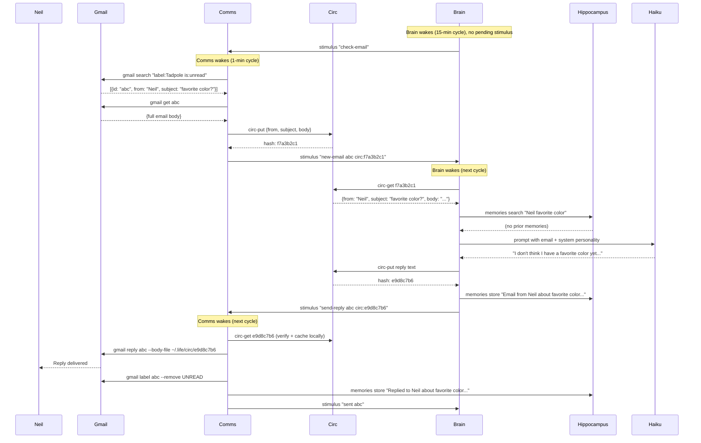

# Comms Organ — Communication I/O

Handles inbound and outbound communication for the organism. Currently supports Gmail via the `gmail` muscle. Designed to eventually support Fastmail/IMAP and SMS (via Phace).

The comms organ is **stimulus-driven** — it does not poll for messages on its own. Another organ (typically the brain) tells it when to check for new messages and when to send replies. All message payloads flow through the circulatory system.

## Modules

| Module | Purpose |
|--------|---------|
| `comms.py` | Stimulus processor — routes check-email and send-reply commands |
| `organ_lib.py` | Shared organ primitives (stimulus, circ, memory ops) — lives at `tadpole/` level |

## Dependencies

| Muscle/Tool | Used For |
|-------------|----------|
| `gmail` | Email search, read, send, reply, label management |
| `circ-put` / `circ-get` | Content-addressed payload storage |
| `stimulus` | Inter-organ messaging |
| `memories` | Store conversation history in hippocampus |

## Cadence

`CADENCE=1` — runs every minute to process pending stimulus. Does NOT auto-check email.

## Stimulus Contract

### Inbound (from brain or other organs)

| Signal | Description |
|--------|-------------|
| `check-email [query]` | Search Gmail for unread emails, report each to brain |
| `send-reply <thread_id> circ:<hash>` | Send the reply body stored at circ hash, mark email as read |
| `send-email <to> <subject> circ:<hash>` | Compose and send a new email (body from circ) |

### Outbound (to brain)

| Signal | Description |
|--------|-------------|
| `new-email <thread_id> circ:<hash>` | New email found — full content (from, subject, body) stored in circ as JSON |
| `sent <thread_id>` | Reply successfully delivered |
| `email-sent <to>` | New email successfully sent |

### Circ Payload Format (new-email)

```json
{
  "id": "thread_abc123",
  "from": "Neil O <masta@gibdon.com>",
  "subject": "Hello Tadpole",
  "body": "Hi there! How are you?"
}
```

## Gmail Muscle

The `gmail` CLI (`~/projects/bin/gmail`) abstracts Gmail access with automatic rate-limit fallback:

- **Primary path**: GAS bridge (`gas gmail.*` commands)
- **Fallback path**: When GAS returns rate-limit errors, automatically switches to Gmail REST API using a cached OAuth token from `gas token.get`
- **Token caching**: `~/.gas/token.json` with atomic write-then-rename, 60s expiry buffer

```bash
gmail search "label:Tadpole is:unread" --count 5
gmail get <thread_id>
gmail send <to> --subject "text" --body "text" | --body-file <path>
gmail reply <thread_id> --body "text" | --body-file <path>
gmail label <thread_id> --remove UNREAD
```

## Example Scenario

Neil sends an email to `knobesq+tadpole@gmail.com` with subject "What's your favorite color?"



## Design Principles

- **Stimulus-driven, not polling** — comms never decides to check email on its own. The brain (or any authorized organ) initiates communication checks. This prevents runaway API usage.
- **Circulatory payloads** — all message content flows through `circ-put`/`circ-get`, never as CLI arguments. This avoids OS arg size limits and can be extended to support attachments and inline images.
- **Mouth-ready** — currently the brain connects directly to comms. A mouth organ will eventually sit between them to enforce one-mind-one-mouth (personality, filtering, tone). The stimulus contract is designed to support this insertion.
- **Muscle abstraction** — comms calls `gmail`, not `gas`. The muscle handles backend selection (GAS bridge vs REST API), token caching, and rate-limit recovery transparently.
- **Memory integration** — every interaction is stored in the hippocampus. Over time, this builds conversational context that shapes future replies.
- **Future-proof** — the stimulus contract is transport-agnostic. Adding Fastmail/IMAP or SMS means adding new muscles, not changing the organ.
