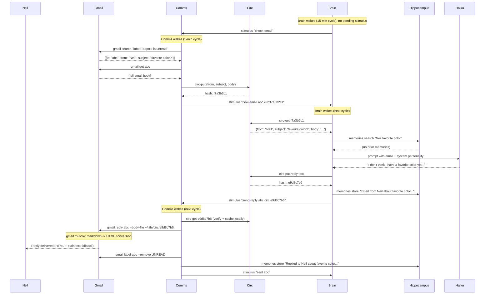

# Comms Organ — Communication I/O

Handles inbound and outbound communication for the organism. Currently supports Gmail via the `gmail` muscle. Designed to eventually support Fastmail/IMAP and SMS (via [Phace](https://github.com/neilobremski/phace)).

The comms organ is **stimulus-driven** — it does not poll for messages on its own. Another organ (typically the brain) tells it when to check for new messages and when to send replies. All message payloads flow through the circulatory system.

## Modules

| Module | Purpose |
|--------|---------|
| `comms.py` | Stimulus processor — routes check-email and send-reply commands |
| `organ_lib.py` | Shared organ primitives (stimulus, circ, memory ops) — lives at `tadpole/` level |

## Dependencies

| Muscle/Tool | Used For |
|-------------|----------|
| `gmail` | Email search, read, send, reply, label management |
| `circ-put` / `circ-get` | Content-addressed payload storage |
| `stimulus` | Inter-organ messaging |
| `memories` | Store conversation history in hippocampus |

## Cadence

`CADENCE=1` — runs every minute to process pending stimulus. Does NOT auto-check email.

## Stimulus Contract

### Inbound (from brain or other organs)

| Signal | Description |
|--------|-------------|
| `check-email <reply-to> [query]` | Search Gmail for unread emails, report each to `reply-to` organ |
| `send-reply <reply-to> <thread_id> circ:<hash>` | Send the reply body stored at circ hash, confirm to `reply-to` |
| `send-email <reply-to> circ:<hash>` | Compose and send a new email (circ payload is JSON: `{to, subject, body, format}`), confirm to `reply-to` |

### Outbound (to brain)

| Signal | Description |
|--------|-------------|
| `new-email <thread_id> circ:<hash>` | New email found — sent to whoever requested `check-email` |
| `sent <thread_id>` | Reply successfully delivered — sent to whoever requested `send-reply` |
| `email-sent <to>` | New email successfully sent — sent to whoever requested `send-email` |

### Circ Payload Format (new-email)

```json
{
  "id": "thread_abc123",
  "from": "Sender Name <user@example.com>",
  "subject": "Hello Tadpole",
  "body": "Hi there! How are you?"
}
```

### Circ Payload Format (send-email / send-reply — rich)

For outbound emails, the circ payload supports markdown body with inline circ images:

```json
{
  "to": "user@example.com",
  "subject": "Daily Summary",
  "body": "# Daily Summary\n\nHere are today's **highlights**:\n\n- Deployed `v2.6`\n- Fixed dashboard bug\n- PR #15 merged\n\n",
  "format": "markdown"
}
```

| Field | Status | Description |
|-------|--------|-------------|
| `body` | Implemented | Email body text. Interpreted based on `format`. Supports `` for inline images. |
| `format` | Implemented | `"markdown"` (default) or `"plain"`. When markdown, the gmail muscle converts to styled HTML. |
| `inline images` | Implemented | Use `` in the markdown body. The gmail muscle calls `circ-get` to retrieve the image, detects MIME type from magic bytes, and embeds it as a `data:` URI in the HTML. |
| `attachments` | Planned | Array of `{name, circ}` objects. The circ hash points to file content in the circulatory system. |

> **Note**: `attachments` are documented for future implementation. Inline images via `` and `body` + `format` are functional.

## Gmail Muscle

The `gmail` CLI (`~/projects/bin/gmail`) abstracts Gmail access with automatic rate-limit fallback:

- **Primary path**: GAS bridge (`gas gmail.*` commands)
- **Fallback path**: When GAS returns rate-limit errors, automatically switches to Gmail REST API using a cached OAuth token from `gas token.get`
- **Token caching**: `~/.gas/token.json` with atomic write-then-rename, 60s expiry buffer

```bash
gmail search "label:Tadpole is:unread" --count 5
gmail get <thread_id>
gmail send <to> --subject "text" --body "text" [--format markdown|plain] [--html "<html>"]
gmail send <to> --subject "text" --body-file <path> [--format markdown|plain]
gmail reply <thread_id> --body "text" [--format markdown|plain] [--html "<html>"]
gmail reply <thread_id> --body-file <path> [--format markdown|plain]
gmail label <thread_id> --remove UNREAD
```

### Format Options

| Flag | Behavior |
|------|----------|
| `--format markdown` | **(default)** Converts body from markdown to styled HTML. Plain text is also sent as fallback. |
| `--format plain` | Sends body as plain text only, no HTML rendering. |
| `--html "<html>"` | Sends pre-rendered HTML directly (bypasses `--format`). Body is still sent as plain text fallback. |

When `--format markdown` is active, the gmail muscle converts markdown to a styled HTML email using a built-in stdlib-only converter that handles: headers, bold, italic, links, code blocks, inline code, ordered/unordered lists, paragraphs, and horizontal rules. The HTML is wrapped in a responsive email template with clean typography.

## Example Scenario

A user sends an email to `organism+label@example.com` with subject "What's your favorite color?"



## Rich Email Example

The brain wants to send Neil a daily summary email with headers, bold text, a list, and a code block. Here is the full flow.

### 1. Brain composes the markdown body and stores it in circ

```python
import json
from organ_lib import circ_put, stimulus_send

body = """\
# Daily Summary — Day 22

Good morning. Here are today's **highlights**.

## Tasks Completed

- Hippocampus v2 merged (PR #15)
- GAS Bridge bumped to `v2.7`
- Fixed [dashboard](https://knobert.dev) rendering bug

## Health Check

All organs running. Uptime: **18 days**.

```
brain:     ok (15-min cycle)
comms:     ok idle
memory:    ok (2341 memories)
```

---

*Sent automatically by the organism.*
"""

payload = json.dumps({
    "to": "user@example.com",
    "subject": "Daily Summary — Day 22",
    "body": body,
    "format": "markdown",
})
ref = circ_put(payload)
stimulus_send("comms", f"send-email brain circ:{ref}")
```

### 2. Comms organ reads circ, calls the gmail muscle

The comms organ extracts the body from circ and passes it to `gmail send` via `--body-file`. The gmail muscle detects `--format markdown` (the default) and converts the markdown to a styled HTML email.

### 3. Gmail muscle renders HTML

The body is converted from markdown to HTML and wrapped in a responsive email template:

```html
<!-- Abbreviated output -->
<h1>Daily Summary — Day 22</h1>
<p>Good morning. Here are today's <strong>highlights</strong>.</p>
<h2>Tasks Completed</h2>
<ul>
  <li>Hippocampus v2 merged (PR #15)</li>
  <li>GAS Bridge bumped to <code>v2.7</code></li>
  <li>Fixed <a href="https://knobert.dev">dashboard</a> rendering bug</li>
</ul>
<h2>Health Check</h2>
<p>All organs running. Uptime: <strong>18 days</strong>.</p>
<pre><code>brain:     ok (15-min cycle)
comms:     ok idle
memory:    ok (2341 memories)</code></pre>
<hr>
<p><em>Sent automatically by the organism.</em></p>
```

Both `body=` (plain text fallback) and `html=` (rendered HTML) are sent to the GAS bridge, so Neil sees a nicely formatted email in any client.

### 4. Inline images via circ references

The brain can embed images stored in the circulatory system directly in email bodies using markdown image syntax with `circ:` URIs:

```json
{
  "to": "user@example.com",
  "subject": "Weekly Report",
  "body": "# Weekly Report\n\nSee the chart below.\n\n\n\nLooks healthy!",
  "format": "markdown"
}
```

The gmail muscle's `_resolve_circ_images()` function processes each `` reference:
1. Calls `circ-get <hash>` to retrieve and cache the image at `~/.life/circ/<hash>`
2. Detects MIME type from magic bytes (PNG, JPEG, GIF, WebP)
3. Base64-encodes the image data into a `data:` URI
4. The normal markdown-to-HTML conversion then produces ``

Per-image limit: 500 KB raw. Cumulative base64 limit: 1 MB. Images exceeding either limit, or that fail retrieval, or are not a recognized format (PNG, JPEG, GIF, WebP), are replaced with alt text. Warnings are printed to stderr. Regular URL images like `` work as standard HTML `` tags.

## Design Principles

- **Stimulus-driven, not polling** — comms never decides to check email on its own. The brain (or any authorized organ) initiates communication checks. This prevents runaway API usage.
- **Circulatory payloads** — all message content flows through `circ-put`/`circ-get`, never as CLI arguments. This avoids OS arg size limits and can be extended to support attachments and inline images.
- **Mouth-ready** — currently the brain connects directly to comms. A mouth organ will eventually sit between them to enforce one-mind-one-mouth (personality, filtering, tone). The stimulus contract is designed to support this insertion.
- **Muscle abstraction** — comms calls `gmail`, not `gas`. The muscle handles backend selection (GAS bridge vs REST API), token caching, and rate-limit recovery transparently.
- **Memory integration** — every interaction is stored in the hippocampus. Over time, this builds conversational context that shapes future replies.
- **Future-proof** — the stimulus contract is transport-agnostic. Adding Fastmail/IMAP or SMS means adding new muscles, not changing the organ.
