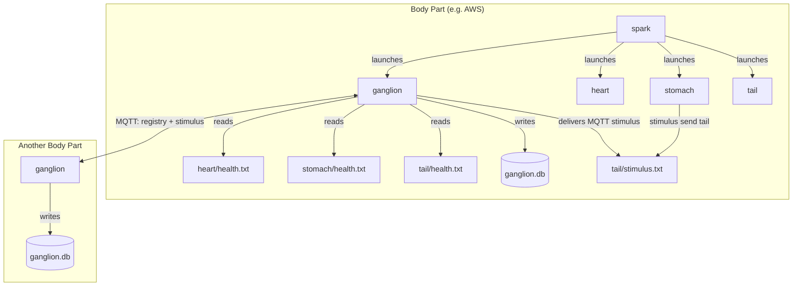

# Ganglion

The nervous system's local node. One per body part.

The ganglion knows what organs exist, how they're doing, and how to reach them. Organs never talk to each other directly — they go through the ganglion via the `stimulus` CLI.

## How It Works



Each cycle (typically 1 minute), the ganglion runs four phases:

1. **Scan** — read local organs' `health.txt`, update the SQLite registry
2. **Journal** — log health changes (only when status changes, not every tick)
3. **Network** — broadcast local registry to other ganglions via MQTT, receive theirs, drain incoming stimulus messages
4. **Report** — write own `health.txt`

## The Registry

SQLite database (`ganglion.db`) with two tables:

**organs** — current state of every known organ (local and remote):

```
type    id          body_part   health_status   health_text         last_seen
heart   heart-aws   aws         ok              ok beat 42          2026-03-18T09:30:00Z
heart   heart-hp    hp          ok              ok beat 17          2026-03-18T09:29:00Z
tail    tail-aws    aws         ok              ok idle             2026-03-18T09:30:00Z
```

**health_log** — journal of health changes over time (duplicate-collapsed):

```
type    id          ts                      status  health_text
heart   heart-aws   2026-03-18T09:00:00Z    ok      ok beat 1
heart   heart-aws   2026-03-18T09:15:00Z    error   error cardiac arrest
heart   heart-aws   2026-03-18T09:16:00Z    ok      ok beat 16
```

Only status *changes* are logged. If the heart reports "ok" for 100 cycles, that's one row — not 100. This lets you answer "how long was this organ degraded?" without drowning in noise.

## Files

```
ganglion/
  live.sh        # organ contract entry point (thin launcher)
  ganglion.py    # the real ganglion (Python, stdlib only)
  organ.conf     # CADENCE=1
  health.txt     # written each cycle: "ok scanned N routed M"
```

## Configuration

The ganglion reads from environment variables (set by `life.conf` via spark):

| Variable | Default | Purpose |
|----------|---------|---------|
| `ORGANS` | *(required)* | Colon-separated organ paths |
| `BODY_PART` | `local` | This body part's name (used for organ IDs) |
| `GANGLION_DB` | `~/.life/ganglion.db` | Path to SQLite registry |
| `MQTT_HOST` | *(empty)* | MQTT broker. If unset, network phases are skipped. |
| `MQTT_PORT` | `1883` | MQTT port |
| `GANGLION_CLIENT_ID` | `<BODY_PART>-ganglion` | MQTT persistent session ID |

## Organ IDs

The ganglion assigns IDs to organs it discovers. The organ itself doesn't know its own ID.

- Single instance: `<type>-<body_part>` (e.g., `heart-aws`)
- Multiple of same type: `<type>-<body_part>-<N>` (e.g., `heart-aws-1`, `heart-aws-2`)

## No Network, No Problem

If `MQTT_HOST` is unset, the ganglion still works — it scans local organs, maintains the registry, and journals health. It just can't see remote organs. Degraded, not dead.

## See Also

- [Nervous System](../life/textbook/nervous-system.md) — full architecture
- [stimulus](../stimulus) — CLI for organs to send signals and query the registry
