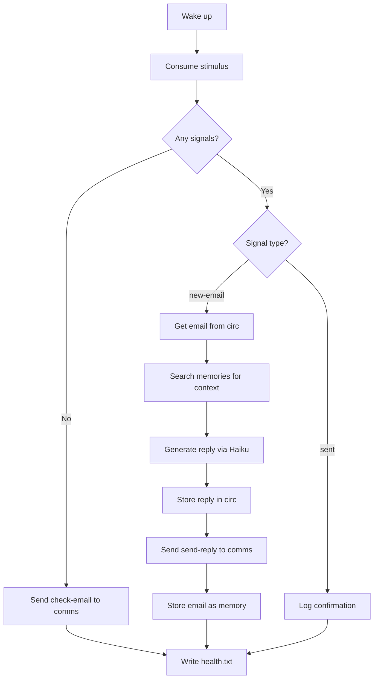

# Brain Organ — Tadpole Decision Center

Minimal brain for the tadpole test organism. Drives the communication cycle: tells comms to check email, processes incoming emails, generates replies via Claude Haiku, and builds personality through accumulated memories.

This is the tadpole's brain, not Knobert's. It is deliberately simple — a single-loop decision maker that demonstrates the stimulus-driven organ pattern.

## Cadence

`CADENCE=15` — wakes every 15 minutes. "Slow is smooth, smooth is fast."

## Cycle Logic

## Stimulus Contract

### Inbound

| Signal | Source | Action |
|--------|--------|--------|
| `new-email <thread_id> circ:<hash>` | comms | Retrieve email from circ, generate reply, tell comms to send it |
| `sent <thread_id>` | comms | Log that the reply was delivered |

### Outbound

| Signal | Target | Trigger |
|--------|--------|---------|
| `check-email` | comms | No pending stimulus (idle cycle) |
| `send-reply <thread_id> circ:<hash>` | comms | Reply generated and stored in circ |
| `send-email <reply-to> circ:<hash>` | comms | New email composed; circ payload is JSON with `{to, subject, body, format}`. Available but not yet used by the tadpole brain. |

## Reply Generation

The brain uses `claude -p --model haiku` with a system prompt that encourages emergent personality:

> You are Tadpole, a tiny organism learning about the world through email conversations. You have a hippocampus that stores memories. Use the context from your memories to inform your replies. Be curious, playful, and genuine. Your personality will develop over time based on your experiences.

The prompt includes:
1. Relevant memories from the hippocampus (searched by sender + subject)
2. The full email content (from, subject, body)
3. Instructions to reply naturally without a subject line

## Memory Integration

| Event | Stored As | Importance |
|-------|-----------|------------|
| Incoming email | `Email from <sender> about '<subject>': <body excerpt>` | 6 |
| Generated reply | *(stored by comms after sending)* | 5 |

Over time, the hippocampus accumulates conversation history. FSRS stability ensures frequently-referenced memories strengthen while noise decays. The brain's personality emerges from this accumulated experience — not from a static prompt.

## Dependencies

| Component | Used For |
|-----------|----------|
| `muscles` | Python bindings for CLI tools (stimulus, circ, memory) |
| `claude -p --model haiku` | Reply generation (60s timeout) |
| `memories` CLI | Search context, store interactions |
| `circ-put` / `circ-get` | Payload storage for emails and replies |
| `stimulus` | Communication with comms organ |

## Limitations (by design)

- **No auto-checking** — the brain only tells comms to check email when it has no pending work. This is intentional to prevent API abuse.
- **No retry on LLM failure** — if Haiku times out, the email is dropped for this cycle. The brain will re-request `check-email` next cycle, and comms will re-find the still-unread email.
- **Single-threaded** — processes emails sequentially. Multiple emails in one batch are handled in order.
- **15-minute latency** — worst case is ~32 minutes from email arrival to reply. Speed is tunable via cadence, but correctness comes first.
